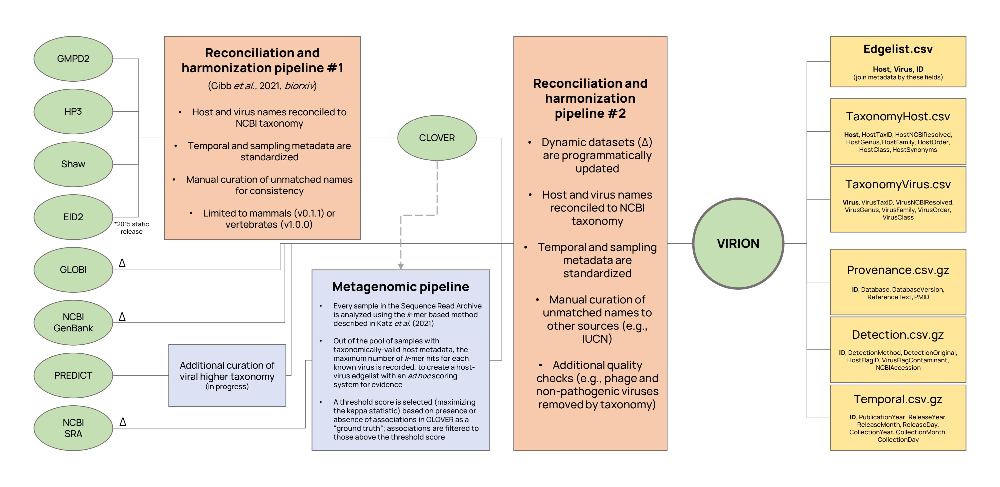

<p align = "center">
  
</p>
&nbsp;
&nbsp;
  
#### The Global Virome, in One Network (VIRION) is an atlas of host-virus interactions. It is the most comprehensive database of its kind, drawing data from scientific literature and online databases, and is updated regularly, with the aim of being up-to-date, accurate, transparent, and useful for scientific inquiry. VIRION is curated by an interdisciplinary team of virologists, ecologists, and data scientists as part of the [Verena Consortium](viralemergence.org).

# How we built VIRION

VIRION aggregates five major sources of information, three of which are dynamic (\*):
- CLOVER, a Verena-curated [database](github.com/viralemergence/clover), which reconciles four static datasets on host-pathogen interactions
- The [public data](https://healthmap.org/predict) released by the USAID Emerging Pandemic Threats PREDICT program 
- GLOBI\*, the [Global Biotic Interactions](http://globalbioticinteractions.org/) database
- NCBI GenBank\*, specifically the entirety of NCBI Virus accessions stored in the Nucleotide database
- NCBI Sequence Read Archive\*, which includes metagenomic samples that have undergone taxonomic analysis

<p align = "center">
  
</p>
&nbsp;
&nbsp;
  
# How to use VIRION

### File organization and assembly

For now, VIRION lives on Github in a 100\% open and reproducible format. To avoid relying on the Large File Storage system, VIRION is disaggregated into one backbone (Edgelist.csv), two taxonomic metadata files (HostTaxonomy.csv, VirusTaxonomy.csv), and three sampling metadata files (Provenance.csv.gz, Detection.csv.gz, Temporal.csv.gz). The metadata files are stored in a compressed format that can be easily manipulated, e.g., using the `vroom` package in `R`. 

The taxonomy files can be joined to the backbone with the "Host" and "Virus" fields, while the metadata files can be joined by the ID field (which must first be separated into unique rows). For simple tasks, not every join will be needed. For example, this R code can be used to find the name of every taxonomically-valid bat host in which any betacoronavirus, classified or unclassified, has been isolated: 

```
library(tidyverse); library(magrittr); library(vroom)
setwd("~/Github/virion/Virion")
edge <- vroom("Edgelist.csv")
host <- vroom("TaxonomyHost.csv"); vir <- vroom("TaxonomyVirus.csv")
det <- vroom("Detection.csv.gz", col_types = c("ID" = 'c'))

host %<>% filter(HostOrder == "chiroptera", HostNCBIResolved == TRUE)
vir %<>% filter(VirusGenus == "betacoronavirus")
det %<>% filter(DetectionMethod == "Isolation/Observation")
edge %<>% separate_rows(ID) %>%
  inner_join(host) %>% inner_join(vir) %>% inner_join(det)

edge %>% pull(Host) %>% unique()
# [1] "chaerephon plicatus"       "pipistrellus abramus"      "rhinolophus affinis"      
# [4] "rhinolophus ferrumequinum" "rhinolophus macrotis"      "rhinolophus pearsonii"    
# [7] "rhinolophus sinicus"       "rousettus leschenaultii"   "tylonycteris pachypus" 
```

### What you should probably know about the data 

You probably haven't worked with a dataset like VIRION before. **Read this before you start your analysis**:

Like most datasets that record host-virus associations, this includes a mix of different lines of evidence, diagnostic methods, and metadata quality. Some associations will be found in every database, with every evidence standard; others will be recorded from a single serological data point with unclear attribution. VIRION can aggregate all this data for you, but it's your job as a researcher to be thoughtful about how you use these data. Some suggested best practices:

- As a starting point, you can remove any records that aren't taxonomically resolved to the NCBI backbone (HostNCBIResolved = FALSE, VirusNCBIResolved = FALSE). We particularly suggest this for data that come from other databases that also aggregate content but use multiple taxonomic backbones, which may include invalid names that are not updated.

- You should also be wary of records with a flag that indicates host identification by researchers was uncertain (HostFlagID = TRUE) or that indicates the virus in a particular metagenomic sample is a common contaminant or false positive (VirusFlagContaminant = TRUE). The former is usually derived from source data, while the latter is provided as part of VIRION's quality control efforts.

- Limiting evidence standards based on diagnostic standards (e.g., using Nucleotide and Isolation/Observation records, but no Antibodies or k-mer) or based on redundancy (i.e., number of datasets that record an association) can also lead to stronger results.

- Finally, we encourage particular caution with regard to the validity of virus names. Although the NCBI and ICTV taxonomies are updated against each other, valid NCBI names are not guaranteed to be ICTV-valid species level designations, and many may include sampling metadata. We recommend that researchers manually curate names where possible, but can also use simple rubrics to reduce down controversial names. For example, in the list of NCBI-accepted betacoronavirus names, eliminating all virus names that include a "/" will reduce many lineage-specific records ("bat coronavirus 2265/philippines/2010", "coronavirus n.noc/vm199/2007/nld") and leave behind cleaner names ("alpaca coronavirus") but won't necessarily catch everything ("bat coronavirus ank045f").

### A special note about the metagenomics 

Unlike nearly every dataset familiar to disease ecologists, the dataset includes a mix of fixed interactions (records based on serology, PCR, or isolation that link a given host and virus pair) and probabilistic interactions (_k_-mer based estimates of the probability a given virus is being detected in a given sample). As such, the data cannot be used off the shelf, and should be *carefully* used with attention to the mix between fixed and probabilistic data.

VIRION includes a mix of _fixed_ and _probabilistic_ interactions. Fixed interactions are known host-virus associations that come from NCBI GenBank and the CLOVER dataset (which is itself a reconciled version of four other datasets: HP3, GMPD2, EID2, and Shaw), and are based on a mix of serology, PCR, and isolation. Probabilistic interactions come from NCBI's Sequence Read Archive (SRA), which includes a mix of targeted sequencing (e.g. whole genomes of isolated virus or PCR products) and shotgun sequencing (e.g. metagenomic or metatranscriptomic data). In any given SRA sample, there may be a mix of different viruses from the given host, and it is challenging to know whether the genome fragments that are present in the sample necessarily indicate the _definite_ presence of a _specific_ virus.We take advantage of a taxonomic analysis using _k_-mer matching performed by NCBI, which returns a score indicating the relative likelihood any virus in NCBI's records has been found in that sample. We validated those data against known records to come up with a very strict cutoff, a test that only X% of possible host-virus pairs pass. The score column is calculated as... (@ryan or @tim please add details)

Even though that analysis is incredibly conservative, users should be _very_ careful about whether or not they include these interactions in their analysis. Example problems they might encounter:

- The highest scoring match might be a known relative of an unknown virus (for example, in a sample with a novel bat betacoronavirus, the highest score might be returned for SARS-CoV)

- The score could be indicative of cross-contamination 
 
- The score could be indicative of experimental (laboratory) infection, which - unlike isolation records - might not necessarily indicate that host can be infected with that virus
 
- The score might be a product of technological issues (see the VirusFlagContaminant field)

As such, users may want to remove all of these records entirely from the dataset, which can be done in a single line of code using the `DetectionMethod` or `Database` columns, e.g., 

```
library(tidyverse); library(magrittr)
virion %<>% filter(!(DetectionMethod == "kmer")) # option 1
virion %<>% filter(!(Database == "SRA")) # option 2 (currently equivalent)
```

Other, more advanced users may be interested in using the entire edgelist of possible host-virus associations in SRA, which is found in `SRA_as_Edgelist.zip`. Alternate scoring methods that are less conservative will include many more false positives, but also potentially more true positives. 

In the long term, we're interested in partnering with virologists and bioinformaticians to develop score metrics that are more informative (for example, % of reference genome recovered) or more advanced ways of mining metagenomic and metatranscriptomic samples for novel (currently undiscovered) viruses, which are both outside the scope of our current dataset and may confound certain analyses with it.

# Additional information
### Citing VIRION

Please do not use VIRION for published research yet!

### Contact
- For general questions about VIRION, please reach out to Colin Carlson (colin.carlson@georgetown.edu) or Gregory Albery 
- For specific questions about the SRA data, please contact Timothée Poisot (timothee.poisot@umontreal.ca) or Ryan Connor
- For specific questions about the CLOVER dataset, please contact Rory Gibb (rory.gibb.14@ucl.ac.uk)
