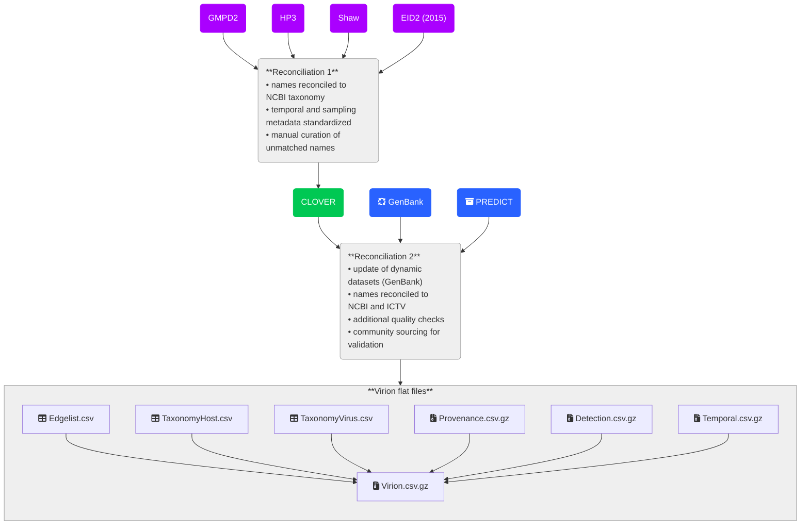

# The VIRION database

VIRION is an atlas of the vertebrate-virus network, maintained by [Verena](https://www.viralemergence.org/), an NSF Biology Integration Institute. The development of the VIRION database through 2022 is documented [here](https://journals.asm.org/doi/10.1128/mbio.02985-21); as we work to transition to a new platform, an interim changelog can also be found below. We strongly encourage researchers to read both the _mBio_ publication and this README file before using these data.

> [!CAUTION]
> Several known taxonomic errors exist in the data. These are documented in the issues on this repository, and we encourage users to add new issues as appropriate. Major changes to viral taxonomy, such as the switch to binomial nomenclature, are also not currently reflected. Finally, users should be cautious about interpretation of the data, and consult the manuscript for guidance about how to handle some of VIRION's unique features, such as a mix of evidentiary standards.

## How to get VIRION

For now, VIRION lives on Github in a fully open and reproducible format. Downloading the data directly from this website, or cloning the repository, is the easiest way to access the data. The full database is available in a single comprehensive file (see *Full database* below), but specific components of the data are also shared as individual files. Currently, all files are compressed in .csv.gz format to minimize storage requirements. The data can be unzipped using tools such as the `vroom` R package or the `CSV.jl` Julia library.

### Download links

- [**Full database**](https://github.com/viralemergence/virion/blob/gh-pages/Virion.csv.gz)

- [Simplified edgelist](https://github.com/viralemergence/virion/blob/gh-pages/Edgelist.csv.gz)

- [Provenance metadata](https://github.com/viralemergence/virion/blob/gh-pages/Provenance.csv.gz)

- [Detection metadata](https://github.com/viralemergence/virion/blob/gh-pages/Detection.csv.gz)

- [Temporal metadata](https://github.com/viralemergence/virion/blob/gh-pages/Temporal.csv.gz)

- [Host higher taxonomy](https://github.com/viralemergence/virion/blob/gh-pages/TaxonomyHost.csv.gz)

- [Virus higher taxonomy](https://github.com/viralemergence/virion/blob/gh-pages/TaxonomyVirus.csv.gz)

## How to use VIRION

### Citing VIRION

If you use VIRION for your research, please both:
1. Cite the publication: Carlson CJ, Gibb RJ, Albery GF, Brierley L, Connor R, Dallas T, Eskew EA, Fagre AC, Farrell MJ, Frank HK, Muylaert RL, Poisot T, Rasmussen AL, Ryan SJ, Seifert SN. The Global Virome in One Network (VIRION): an Atlas of Vertebrate-Virus Associations. mBio. 2022 Mar 1. DOI: 10.1128/mbio.02985-21.
2. Include the following statement in your acknowledgements: "This project was supported by the Verena data ecosystem, funded by the U.S. National Science Foundation (NSF DBI 2213854)."
 
If necessary (e.g., for specific journal requirements), you can also cite VIRION itself using this DOI: .

### Reproducing VIRION

VIRION is currently distributed under a CC-0 license. As such, you can do just about anything with it that you'd like. We would _prefer_ it not be reproduced into other formats that lose intentional aspects of VIRION's design (e.g., in other databases that drop metadata like evidence standards; as static supplemental files on studies that will never be updated; etc.), but it's your party! 

## How VIRION works

The VIRION database is periodically re-compiled from two static sources (CLOVER and PREDICT) and one dynamic source (GenBank). If you want to reproduce the vignettes we present in the publication, you can also download the entire release of [version 0.2.1](https://github.com/viralemergence/virion/releases/tag/v0.2.1-beta).

> [!NOTE]
> Over the coming months, we hope to roll out additional changes. Goals include:
> - a revision of the license VIRION is distributed under
> - incorporation of new data sources
> - improved data standardization and taxonomic reconciliation
> - periodic updates to the static components of CLOVER to address known errors

## Additional information

### Contact

- For general questions about VIRION, please reach out to [Cecilia Sanchez](mailto:cecilia@viralemergence.org)
- For specific questions about the CLOVER dataset, please contact [Rory Gibb](mailto:rory.gibb.14@ucl.ac.uk)
- For specific questions about the GitHub actions pipeline, please contact [Timothée Poisot](mailto:timothee.poisot@umontreal.ca)

### Changelog 

**October 17, 2024**: The GLOBI dataset has been de-indexed from VIRION, due to a growing number of concerns about the reliability of text-mined data. This represents an important departure from the pipeline described in the _mBio_ publication. The current pipeline is described at the top of this README.
