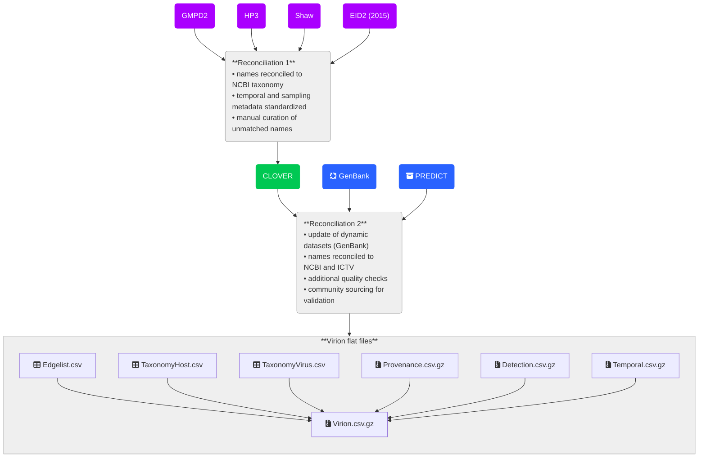

# The VIRION database

VIRION is an atlas of the vertebrate-virus network, maintained by [Verena](https://www.viralemergence.org/), an NSF Biology Integration Institute. 
The development of the VIRION database through 2022 is documented [here](https://journals.asm.org/doi/10.1128/mbio.02985-21); as we work to transition to a new platform, an interim changelog can also be found below.
We strongly encourage researchers to read both the _mBio_ publication and this README file before using these data.

> [!CAUTION]
> Several known taxonomic errors exist in the data. 
> These are documented in the issues on this repository, and we encourage users to add new issues as appropriate.
> Major changes to viral taxonomy, such as the switch to binomial nomenclature as described by ICTV and [adopted by NCBI](https://ncbiinsights.ncbi.nlm.nih.gov/2025/04/25/ncbi-taxonomy-updates-virus-classification-april-2025/), may not be reflected in all instances.
> Finally, users should be cautious about interpretation of the data, and consult the manuscript for guidance about how to handle some of VIRION's unique features, such as a mix of evidentiary standards.

## How to get VIRION

The code for producing the virion data set can be found in this repository. 
See the [reproducing virion wiki](https://github.com/viralemergence/virion/wiki/Reproducing-Virion) for details.

The easiest way to get the data is to use the [virionData R package](https://viralemergence.github.io/virionData/) or
download it from [Zenodo](https://doi.org/10.5281/zenodo.15643003) .

Currently, all large files are compressed in .csv.gz format to minimize storage requirements. 
These files are comma delimited with period decimal separators. 
The data can be unzipped using tools such as the `vroom` R package or the `CSV.jl` Julia library.
For more information about using specific versions of the code or data, see the [code versioning](https://github.com/viralemergence/virion/wiki/Development-process#releases---code-versioning) or
[data versioning](https://github.com/viralemergence/virion/wiki/Data-Versioning) sections of the wiki.

## How to use VIRION

### Citing VIRION

If you use VIRION for your research, please:
1. Cite the publication: Carlson CJ, Gibb RJ, Albery GF, Brierley L, Connor R, Dallas T, Eskew EA, Fagre AC, Farrell MJ, Frank HK, Muylaert RL, Poisot T, Rasmussen AL, Ryan SJ, Seifert SN. The Global Virome in One Network (VIRION): an Atlas of Vertebrate-Virus Associations. mBio. 2022 Mar 1. DOI: 10.1128/mbio.02985-21.
2. Cite the version of the data you used - `virionData::get_citation(zenodo_id = "ZENODO_ID_FOR_VERSION", style = "apa")`
3. Include the following statement in your acknowledgements: "This project was supported by the Verena data ecosystem, funded by the U.S. National Science Foundation (NSF DBI 2213854)."
 
If necessary (e.g., for specific journal requirements), you can also cite the VIRION codebase itself using this DOI: .

### Code and data licenses

The code in this repository is covered by an LGPL3 license. 
This is a copy left license that requires anyone redistributing this code to 
include an LGPL3 license for that portion of the code base.  

Checkout the full license language here: https://choosealicense.com/licenses/lgpl-3.0/

VIRION data is currently distributed under a ODbL-1.0 license.
As such, you can do just about anything with it that you'd like.
If you reproduce and re-distribute the data, you must include an equivalent share-a-like license.
If you place the data behind an authentication portal or paywall, you must also share a freely available version.

Check out the full license language for the data here: https://opendatacommons.org/licenses/odbl/1-0/

## How VIRION works

The VIRION database is periodically re-compiled from two static sources (CLOVER and PREDICT) and one dynamic source (GenBank). If you want to reproduce the vignettes we present in the publication, you can also download the entire release of [version 0.2.1](https://github.com/viralemergence/virion/releases/tag/v0.2.1-beta).

> [!NOTE]
> Over the coming months, we hope to roll out additional changes. 
> See the github issues to get an understanding of where the project is headed.

## Additional information

See the [repo wiki](https://github.com/viralemergence/virion/wiki) for additional information on development processes and github actions.

### Contact

- For general questions about VIRION, please reach out to [Collin Schwantes](mailto:collin@viralemergence.org) or [Cecilia Sanchez](mailto:cecilia@viralemergence.org)
- For specific questions about the CLOVER dataset, please contact [Rory Gibb](mailto:rory.gibb.14@ucl.ac.uk)
- For specific questions about the GitHub actions pipeline, please contact [Collin Schwantes](mailto:collin@viralemergence.org) or [Timothée Poisot](mailto:timothee.poisot@umontreal.ca)

### Changelog 

This section highlights major changes to the repo.

See [release notes](https://github.com/viralemergence/virion/releases) for details on changes. 

**June 24, 2025**: Virion data will be stored in Zenodo and can be accessed via
the [virionData package](https://github.com/viralemergence/virionData).

**October 17, 2024**: The GLOBI dataset has been de-indexed from VIRION, due to a growing number of concerns about the reliability of text-mined data.
This represents an important departure from the pipeline described in the _mBio_ publication.
The current pipeline is described at the top of this README.
