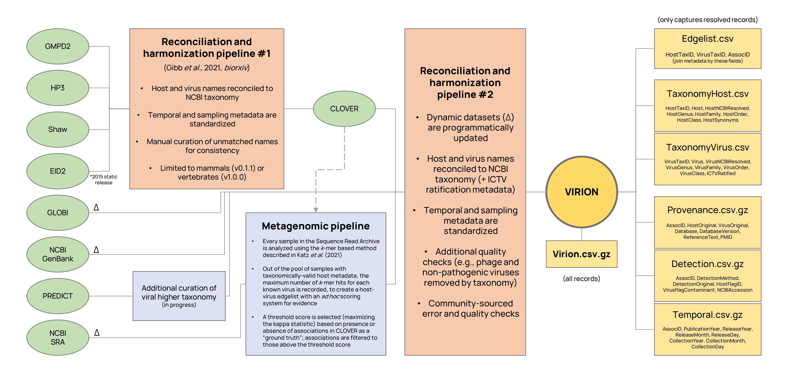
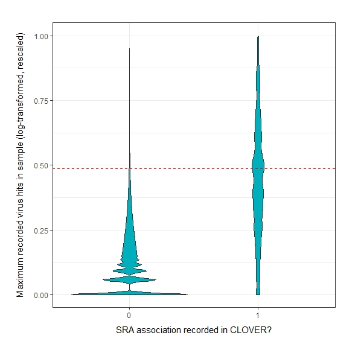

<p align = "center">
  
</p>
&nbsp;
&nbsp;
  
### The Global Virome, in One Network (VIRION) is an atlas of host-virus interactions. 

#### VIRION is the most comprehensive database of its kind, drawing data from scientific literature and online databases, and is updated automatically with new data. VIRION is curated by an interdisciplinary team of virologists, ecologists, and data scientists as part of the [Verena Consortium](viralemergence.org), an effort to predict which viruses could infect humans, which animals host them, and where they could someday emerge.

We encourage researchers to review this entire guide before using these data.

# How we built VIRION

VIRION aggregates five major sources of information, three of which are dynamic (\*):
- CLOVER, a Verena-curated [database](github.com/viralemergence/clover), which reconciles four static datasets on host-pathogen interactions
- The [public data](https://healthmap.org/predict) released by the USAID Emerging Pandemic Threats PREDICT program 
- GLOBI\*, the [Global Biotic Interactions](http://globalbioticinteractions.org/) database
- NCBI GenBank\*, specifically the entirety of NCBI Virus accessions stored in the Nucleotide database
- NCBI Sequence Read Archive\*, which includes metagenomic samples that have undergone taxonomic analysis

<p align = "center">
  
</p>
&nbsp;
&nbsp;
 
These methods will be further described in a forthcoming preprint / publication by Carlson _et al._

# How to use VIRION

VIRION can be used for everything from deep learning to simple biological questions. For example, if you wanted to ask which bats a betacoronavirus (like SARS-CoV or MERS-CoV) has ever been isolated from, you could run this `R` code:

```
> library(tidyverse); library(vroom)
> virion <- vroom("Virion/Virion.csv.gz")
> virion %>% filter(VirusGenus == "betacoronavirus",
+                   HostOrder == "chiroptera",
+                   DetectionMethod == "Isolation/Observation") %>% 
+     pull(Host) %>% unique
[1] "chaerephon plicatus"       "pipistrellus abramus"      "rhinolophus affinis"      
[4] "rhinolophus ferrumequinum" "rhinolophus macrotis"      "rhinolophus pearsonii"    
[7] "rhinolophus sinicus"       "rousettus leschenaultii"   "tylonycteris pachypus"    
```

### File organization and assembly

For now, VIRION lives on Github in a 100\% open and reproducible format. To avoid relying on the Large File Storage system, VIRION is stored in two formats.

1. The entire database is available in `virion/Virion.csv.gz` which can be easily read as-is using the `vroom` package.
2. The NCBI-matched components of the database are also available in a disaggregated format with a backbone (Edgelist.csv), two taxonomic metadata files (HostTaxonomy.csv, VirusTaxonomy.csv), and three sampling metadata files (Provenance.csv.gz, Detection.csv.gz, Temporal.csv.gz). The taxonomy files can be joined to the backbone with the `HostTaxID` and `VirusTaxID` fields, while the metadata files can be joined by the `AssocID` field (which must first be separated into unique rows). For simple tasks, not every join will be needed. 

### What you should probably know about the data 

Like most datasets that record host-virus associations, this includes a mix of different lines of evidence, diagnostic methods, and metadata quality. Some associations will be found in every database, with every evidence standard; others will be recorded from a single serological data point with unclear attribution. VIRION can aggregate all this data for you, but it's your job as a researcher to be thoughtful about how you use these data. Some suggested best practices:

- As a starting point, you can remove any records that aren't taxonomically resolved to the NCBI backbone (HostNCBIResolved = FALSE, VirusNCBIResolved = FALSE). We particularly suggest this for data that come from other databases that also aggregate content but use multiple taxonomic backbones, which may include invalid names that are not updated.

- You should also be wary of records with a flag that indicates host identification by researchers was uncertain (HostFlagID = TRUE) or that indicates the virus in a particular metagenomic sample is a common contaminant or false positive (VirusFlagContaminant = TRUE). The former is usually derived from source data, while the latter is provided as part of VIRION's quality control efforts.

- Limiting evidence standards based on diagnostic standards (e.g., using Nucleotide and Isolation/Observation records, but no Antibodies or k-mer) or based on redundancy (i.e., number of datasets that record an association) can also lead to stronger results.

- We encourage particular caution with regard to the validity of virus names. Although the NCBI and ICTV taxonomies are updated against each other, valid NCBI names are not guaranteed to be ICTV-valid species level designations, and many may include sampling metadata. We recommend that researchers manually curate names where possible, but can also use simple rubrics to reduce down controversial names. For example, in the list of NCBI-accepted betacoronavirus names, eliminating all virus names that include a "/" will reduce many lineage-specific records ("bat coronavirus 2265/philippines/2010", "coronavirus n.noc/vm199/2007/nld") and leave behind cleaner names ("alpaca coronavirus") but won't necessarily catch everything ("bat coronavirus ank045f"). Another option is to limit analysis to viruses that are ICTV ratified, but this is particularly conservative, and will leave a much larger number of valid virus names out.

- Finally, we encourage every researcher who uses this data to make a deliberate choice about the use of metagenomic data (see below).

### A special note about the metagenomics 

Unlike nearly every dataset familiar to disease ecologists, this dataset includes a mix of known interactions (e.g., PCR detection of virus) and _predicted interactions_ (the _k_-mer analysis conducted on the Sequence Read Archive). As such, the data cannot be used safely and uncritically off the shelf, **it should not be indexed in other datasets of known interactions**, and it should be carefully evaluated by researchers with attention to the mix of data standards.



To generate the SRA component of the dataset, we used a _k_-mer based [taxonomy tool](https://www.biorxiv.org/content/10.1101/2021.02.16.431451v1) which identifies the number of virus "hits" in a host sample. Starting from an analysis of every possible pairwise combination (given in `SRA_as_Edgelist.zip` for any interested researchers), we identified the maximum number of hits for a given pair. Subsequently, we use the CLOVER data as a ground truth (for "known associations" or not) to identify the most plausible associations, with a threshold selected that maximizes the kappa statistic. This returns the top ~1% of possible associations (see the figure to the right). Given that most matches are likely to be imprecise, we currently restrict the taxonomy of these matches to the genus level and above (though species matches can be reconstructed from the VirusTaxID field at this time).

Even though this analysis is incredibly conservative, it is in a preliminary state, and only _predicts_ possible associations. (These could later be confirmed, for example, by assembling viral genomes from the original SRA samples.) As such, users should be _very_ careful about whether or not they include these interactions in their analysis. Example problems they might encounter:

- The prediction could, simply, be a false positive. This is an imprecise method.

- The highest scoring match might be a known relative of an unknown virus (for example, in a sample with a novel bat betacoronavirus, the highest score might be returned for SARS-CoV). This is partially solved by removing the Virus names, but not entirely.
 
- The score might be a product of technological issues or cross-contamination (see the VirusFlagContaminant field).

As such, users may want to remove all of these records entirely from the dataset, which can be done in a single line of code using the `DetectionMethod` or `Database` columns, e.g., 

```
library(tidyverse); library(magrittr)
virion %<>% filter(!(DetectionMethod == "kmer")) # option 1
virion %<>% filter(!(Database == "SRA")) # option 2 (currently equivalent)
```

Other, more advanced users may be interested in using the entire edge list of possible host-virus associations in SRA, which is found in `SRA_as_Edgelist.zip`. Alternate scoring methods that are less conservative will include many more false positives, but also potentially more true positives. In the long term, we hope to develop score metrics that are more informative but still easily incorporated into the VIRION architecture. 

# Additional information
### Citing VIRION

Please do not use VIRION for published research yet!

### Contact
- For general questions about VIRION, please reach out to [Colin Carlson](colin.carlson@georgetown.edu) or [Gregory Albery](gfalbery@gmail.com).
- For specific questions about the SRA data, please contact [Timothée Poisot](timothee.poisot@umontreal.ca) or [Ryan Connor](ryan.connor@nih.gov).
- For specific questions about the CLOVER dataset, please contact [Rory Gibb](rory.gibb.14@ucl.ac.uk).
