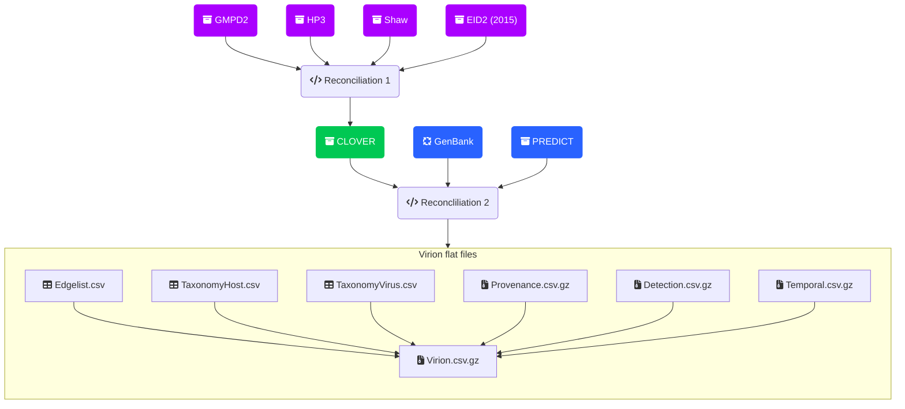

Access the database at the web interface [here](https://viralemergence.github.io/virion/).

```mermaid
flowchart TB

%% Nodes
    GMPD2("fa:fa-box-archive GMPD2")
    HP3("fa:fa-box-archive HP3")
    Shaw("fa:fa-box-archive Shaw")
    EID2("fa:fa-box-archive EID2 (2015)")

    RECON1("fa:fa-code Reconciliation 1")

    CLOVER("fa:fa-box-archive CLOVER")


    GenBank("fa:fa-arrows-spin GenBank")

    PREDICT("fa:fa-box-archive PREDICT")

    RECON2("fa:fa-code Reconcliliation 2")


    subgraph virion[Virion flat files]
        Virion["fa:fa-file-zipper Virion.csv.gz"]
        Edgelist["fa:fa-table Edgelist.csv"]
        TaxonomyHost["fa:fa-table TaxonomyHost.csv"]
        TaxonomyVirus["fa:fa-table TaxonomyVirus.csv"]
        Provenance["fa:fa-file-zipper Provenance.csv.gz"]
        Detection["fa:fa-file-zipper Detection.csv.gz"]
        Temporal["fa:fa-file-zipper Temporal.csv.gz"]
        direction TB
        Edgelist --> Virion
        TaxonomyHost --> Virion
        TaxonomyVirus --> Virion
        Provenance --> Virion
        Detection --> Virion
        Temporal --> Virion
    end

%% Edge connections between nodes
    GMPD2 --> RECON1;
    HP3 --> RECON1;
    Shaw --> RECON1;
    EID2 --> RECON1;
    RECON1 --> CLOVER;

    CLOVER --> RECON2;
    GenBank --> RECON2;
    PREDICT --> RECON2;

    RECON2 --> virion;

%% Individual node styling. Try the visual editor toolbar for easier styling!
    style GMPD2 color:#FFFFFF, fill:#AA00FF, stroke:#AA00FF
    style HP3 color:#FFFFFF, fill:#AA00FF, stroke:#AA00FF
    style Shaw color:#FFFFFF, fill:#AA00FF, stroke:#AA00FF
    style EID2 color:#FFFFFF, fill:#AA00FF, stroke:#AA00FF

    style CLOVER color:#FFFFFF, stroke:#00C853, fill:#00C853

    style GenBank color:#FFFFFF, stroke:#2962FF, fill:#2962FF
    style PREDICT color:#FFFFFF, stroke:#2962FF, fill:#2962FF

%% You can add notes with two "%" signs in a row!
```
