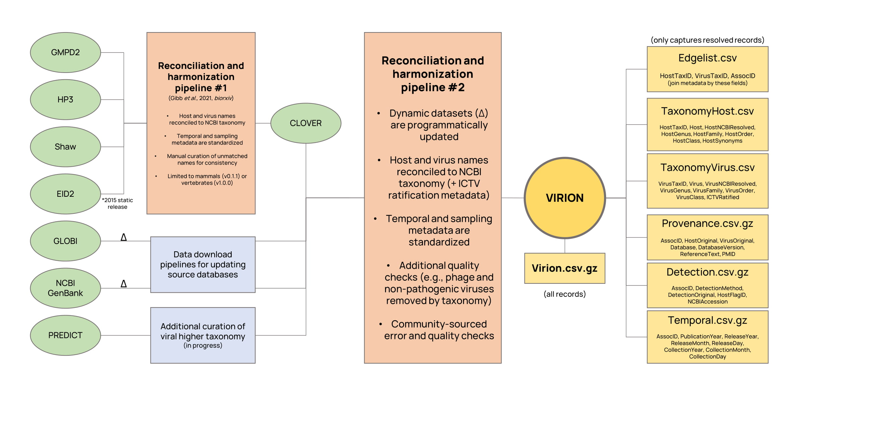

<p align = "center">
  
</p>
&nbsp;
&nbsp;
  
### The Global Virome, in One Network (VIRION) is an open atlas of the vertebrate virome.

#### The VIRION database was built by, and is curated by, an interdisciplinary team of virologists, ecologists, and data scientists as part of the [Verena Consortium](https://www.viralemergence.org/), an effort to predict which viruses could infect humans, which animals host them, and where they could someday emerge.

VIRION is the most comprehensive database of its kind, drawing data from scientific literature and online databases, and is updated automatically with new data. Today, it includes over 2.8 million interactions that capture roughly 25% of known mammal diversity, 10% of bird diversity, and 6% of total vertebrate diversity. Unlike many other databases, VIRION has undergone a taxonomic reconciliaton process using a backbone provided by [NCBI](https://www.ncbi.nlm.nih.gov/Taxonomy/Browser/wwwtax.cgi), with a total (at last count) of 3,787 valid vertebrate host species and 9,003 valid viruses, of which 1,658 are ICTV-ratified valid names. 

VIRION is part of an ongoing effort to build an open data ecosystem in viral ecology, and has been released prior to a preprint, publication, or peer-review process. As such, we strongly discourage the reproduction of the data in other databases at this time.

We encourage researchers to **review this entire guide** before using these data.

# How we built VIRION

VIRION aggregates seven major sources of information, two of which can be dynamically updated (\*):
- CLOVER, a Verena-curated [database](https://github.com/viralemergence/clover), which reconciles four static datasets on host-pathogen interactions.
- The [public data](https://healthmap.org/predict) released by the USAID Emerging Pandemic Threats PREDICT program.
- GLOBI\*, the [Global Biotic Interactions](http://globalbioticinteractions.org/) database.
- NCBI GenBank\*, specifically the entirety of NCBI Virus accessions stored in the Nucleotide database.

<p align = "center">
  
</p>
&nbsp;
&nbsp;
 
These methods will be further described in a forthcoming preprint / publication by Carlson _et al._

# How to use VIRION

VIRION can be used for everything from deep learning to simple biological questions. For example, if you wanted to ask which bats a betacoronavirus (like SARS-CoV or MERS-CoV) has ever been isolated from, you could run this `R` code:

```
> library(tidyverse); library(vroom)
> 
> virion <- vroom("Virion/Virion.csv.gz")
> 
> virion %>% 
+   filter(VirusGenus == "betacoronavirus",
+          HostOrder == "chiroptera",
+          DetectionMethod == "Isolation/Observation") %>% 
+   pull(Host) %>% 
+   unique()
[1] "chaerephon plicatus" "pipistrellus abramus" "rhinolophus affinis"      
[4] "rhinolophus ferrumequinum" "rhinolophus macrotis" "rhinolophus pearsonii"    
[7] "rhinolophus sinicus" "rousettus leschenaultii" "tylonycteris pachypus"
```

It's that simple! Here's a few small tips and tricks you should know:
- All resolved taxonomy is lowercase (see the above example); original metadata retains case, and non-taxonomic metadata is not all lowercase
- Some valid records have NA's in their taxonomy; for example, if an unclassified _Betacoronavirus_ is found in a mouse, it might be recorded as NA in the "Virus" field. This is an intentional feature, as it enables researchers to talk about higher-level taxonomic patterns, and [some studies](https://www.biorxiv.org/content/10.1101/2020.05.22.111344v3) may not need fully-resolved data. 
- Sometimes, you'll see taxonomy that's outdated or strange. If you think there's an error, please leave an issue on the Github. Before you do, it may be worth checking whether a given name is correctly resolved to the NCBI taxonomy; for example, in R, you can use `taxize::classification("Whateverthe latinnameis", db = "ncbi")`. If the issue is related to that taxonomic backbone, please label your issue `ncbi-needed`
- Different databases may have overlapping records. For example, some PREDICT records are deposited in GenBank, and some GenBank records are inherited by EID2. As different data has passed between these sources, they've often lost some metadata. Presence in different datasets therefore does not indicate stronger / weaker evidence, and conversely, conflicting evidence between databases may not be indicative of any biological evidence.

### File organization and assembly

For now, VIRION lives on Github in a 100\% open and reproducible format. Downloading the data directly from this website, or cloning the repository, is the easiest way to access the data. To avoid relying on the Large File Storage system, the VIRION database itself is stored in two file formats:

1. The entire database is available in `Virion/Virion.csv.gz` which can be easily read as-is using the [`vroom` package](https://vroom.r-lib.org/).
2. The NCBI-matched components of the database are also available in a disaggregated format with a backbone (Edgelist.csv), two taxonomic metadata files (HostTaxonomy.csv, VirusTaxonomy.csv), and three sampling metadata files (Provenance.csv.gz, Detection.csv.gz, Temporal.csv.gz). The taxonomy files can be joined to the backbone with the `HostTaxID` and `VirusTaxID` fields, while the metadata files can be joined by the `AssocID` field (which must first be separated into unique rows). For simple tasks, not every join will be needed. 

### What you should probably know about the data 

Like most datasets that record host-virus associations, this includes a mix of different lines of evidence, diagnostic methods, and metadata quality. Some associations will be found in every database, with every evidence standard; others will be recorded from a single serological data point with unclear attribution. VIRION can aggregate all this data for you, but it's your job as a researcher to be thoughtful about how you use these data. Some suggested best practices:

- As a starting point, you can remove any records that aren't taxonomically resolved to the NCBI backbone (`HostNCBIResolved == FALSE, VirusNCBIResolved == FALSE`). We particularly suggest this for data that come from other databases that also aggregate content but use multiple taxonomic backbones, which may include invalid names that are not updated.

- You should also be wary of records with a flag that indicates host identification by researchers was uncertain (`HostFlagID == TRUE`).

- Limiting evidence standards based on diagnostic standards (e.g., using Nucleotide and Isolation/Observation records, but no Antibodies or k-mer) or based on redundancy (i.e., number of datasets that record an association) can also lead to stronger results.

- We encourage particular caution with regard to the validity of virus names. Although the NCBI and ICTV taxonomies are updated against each other, valid NCBI names are not guaranteed to be ICTV-valid species level designations, and many may include sampling metadata. We recommend that researchers manually curate names where possible, but can also use simple rubrics to reduce down controversial names. For example, in the list of NCBI-accepted betacoronavirus names, eliminating all virus names that include a "/" (e.g., using `stringr::str_detect()`) will reduce many lineage-specific records ("bat coronavirus 2265/philippines/2010", "coronavirus n.noc/vm199/2007/nld") and leave behind cleaner names ("alpaca coronavirus") but won't necessarily catch everything ("bat coronavirus ank045f"). Another option is to limit analysis to viruses that are ICTV ratified (`ICTVRatified == TRUE`), but this is particularly conservative, and will leave a much larger number of valid virus names out.

# Additional information
### Citing VIRION

Please do not use VIRION for published research yet! This is only a beta release and probably contains a _number_ of bugs that we still need to fix. (Similarly, so those bugs don't escape our orbit, please don't reproduce the data elsewhere yet!)

### Contact
- For general questions about VIRION, please reach out to [Colin Carlson](colin.carlson@georgetown.edu).
- For specific questions about the CLOVER dataset, please contact [Rory Gibb](rory.gibb.14@ucl.ac.uk).
